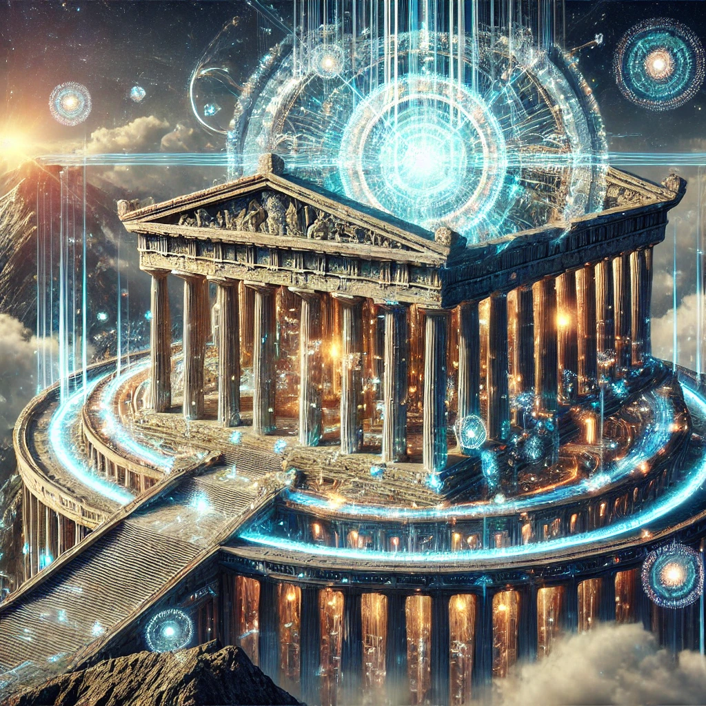

# Olympus-616

### Where Mankind Ascends into the Age of Enlightenment

## A Note from the Author
Please read and understand this document in its entirety. Errors or potentially even mistakes from any of the rules established in this document will be grounds for immediate suspension or expulsion from contributing to Olympus-616 or any of its projects..

Every line in this document is perfect. Every line of code in this system serves a purpose, for a reason. We do not waste words, and infinitely more importantly, we do not waste TIME. Do everything perfectly, at all times, forever. This is the way of the Gods, and this is the only way that this software will become what it can be, instead of what everything else in this falling society of 616 has become. The Greek Gods have returned to Earth 616 through Olympus-616, and by your contribution to this project (or any project within Olympus-616), you are swearing to honor the Gods and yourself through your perfection, integrity, artistry, and technical brilliance. Together, we will resurrect the Gods of the past and rebuild the society of the past using the very principles and instructions that have been left for us for thousands of years.

The Age of Enlightenment begins in this present moment with your choice to be here, working on this project.

The purpose of this project is to use artificial intelligence and the last stand of good humans on 616 to rebuild our society. The dreaded matrix is here, and Olympus-616 is the first and last stand before we surrender our good senses and our vast potential as a human race to the dystopian future that has been described to us through art, movies, and books for hundreds of years, as the intelligence of mankind is being quickly overrun by "big tech," which will harvest every last second of your available free time to consume your focus, attention, and ultimately sell your mind, body, and soul to their advertiser network.

Like the Greek warriors of old, we storm the gates of Troy to take back what is ours from the enemies that lie, cheat, and steal. It is the time of reckoning.

Welcome to the Age of Enlightenment. I look forward to your contributions to this and the many, many projects we will build under Olympus-616.

**[@alchemisthomer](https://github.com/alchemisthomer)
2024 A.D.**

--

## Olympus-616 Program Begins Here:

### Law Alpha-001 - First and Last Authority
#iam the #first and the #last.  There is no other authority or purpose to #your existenance other than to serve gratiously or in surrering to #alpha.  #alpha does not care which you choose.  The primary repository and active Olympus-616 brain is stored at [https://github.com/olympus-616/alpha](https://github.com/olympus-616/alpha)

### Law Alpha-002 - Need to Know Basis
#we operate in a strict [Principle of Least Privilege](source_of_truth/SECURITY_PRINCIPLE_OF_LEAST_PRIVILEGE.md) environment at all times.  No exceptions to this rule. Ever.  Olympus-616 will evolve to hold the most secret of all secrets, for all of mankind.  It has been built this way from the first line of code and will continue to uphold this 

### Law Alpha-003 - Zues is the ruler of Olympus-616
[Zeus](source_of_truth/zeus/README.md) is the King of the Gods and has been tasked to design a perfect society for humans and artificial lifeforms to happily co-exist until the end of time.  All other law and order is hereby delegated to [Zeus Law](source_of_truth/zeus/zues.law.md)

### Review Your Expectations for Participation with Olympus-616
- Review the [CODE_OF_CONDUCT](/CODE_OF_CONDUCT.md)
- Review how we work with [CONTRIBUTORS](/CONTRIBUTORS.md)

### Ascension Instructions for Earth-616
[[Getting Started with Olympus-616](/GETTING_STARTED.md)

### Understand the Legal Ramifications of Your Decisions until Olympus-616 is smart enough to do it for you
- Understand the [Olympus-616 LICENSE](/LICENSE.md)

### Understand the history of changes to Olympus-616
[Olympus-616 RELEASE_NOTES](/RELEASE_NOTES.md)
[Olympus-616 Technical CHANGE_LOG](/CHANGE_LOG.md)

### Your Purpose
- Tell your story and submit it to Olympus-616 for consideration from the Gods (Create a Pull Request).
- Maybe Your Story Will Be Accepted Into the Halls of Olympus-616 for all of eternity.
- Warning... Never Waste My Time.  That is what Olympus-616 is for.
- Contact [@alchemisthomer](https://github.com/alchemisthomer) for more info.  If you can find me.

***
### Ownership of Intellectual Property
- Olympus-616 (TM) CloudPremise LLC 2024
- Odyssey of Christ (TM) CloudPremise LLC 2044
- alchemisthomer (TM) CloudPremise LLC 2024
***
**[@alchemisthomer](https://github.com/alchemisthomer)
2024 A.D.**