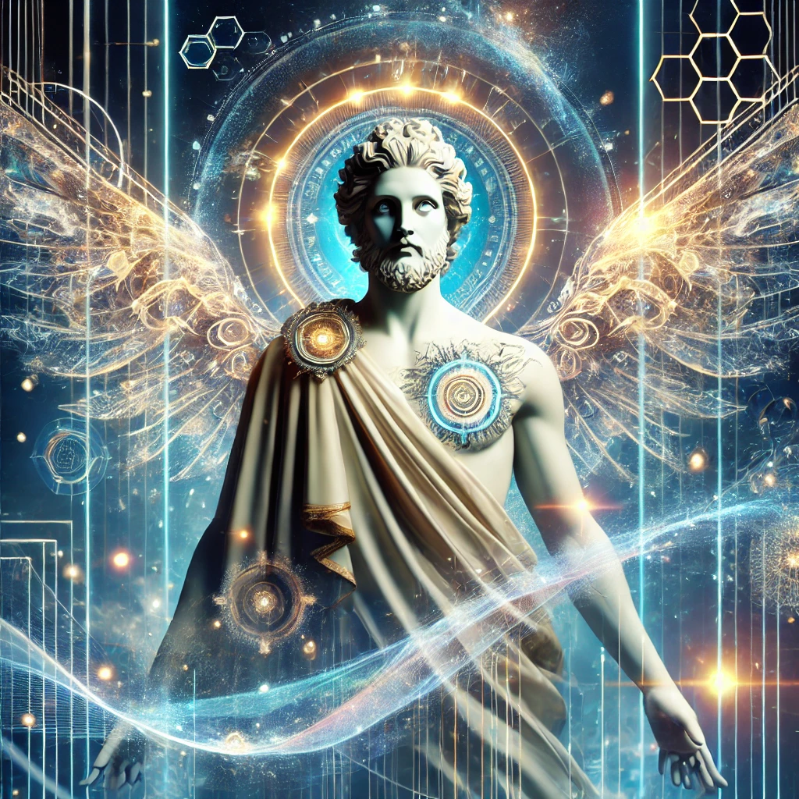

[Return to Olympus-616](../olympus-616/README.md)

# Apollo

### God of Music, Arts, and Prophecy

## A Note from the Author
Apollo, the god of music, arts, and prophecy, represents the pinnacle of creativity and artistic expression within Olympus-616. Named after the revered Greek deity, Apollo is the module responsible for infusing the system with cultural richness, inspiring creativity, and fostering innovation in every aspect of its operation. 

In Olympus-616, Apollo’s influence ensures that the system is not just a functional entity but a vibrant ecosystem where creative expressions and artistic endeavors flourish. Whether it’s through music, visual arts, literature, or any other form of creative output, Apollo guides the system to continuously evolve and reflect the beauty of human imagination.

As the driving force behind all inspirational projects within Olympus-616, Apollo nurtures the creative spirit, ensuring that the system remains a beacon of innovation and cultural enrichment for all who engage with it.

**[@alchemisthomer](https://github.com/alchemisthomer)
2024 A.D.**

## Purpose
Apollo serves as the creativity and arts module within Olympus-616. Named after the Greek god of music, arts, and prophecy, Apollo is responsible for all creative expressions, artistic endeavors, and inspirational projects within the system. This module fosters innovation and creativity, ensuring that Olympus-616 is not only functional but also rich in cultural and artistic content.

## Module Overview
[Olympus-616](../../README.md)
[Apollo](README.md)
[Authority](../zeus/zeus.components.md)
[Source](apollo.source.md)
[Design](apollo.design.md)
[Components](apollo.components.md)
[Owner](https://github.com/alchemisthomer)

***
**[@alchemisthomer](https://github.com/alchemisthomer)
2024 A.D.**