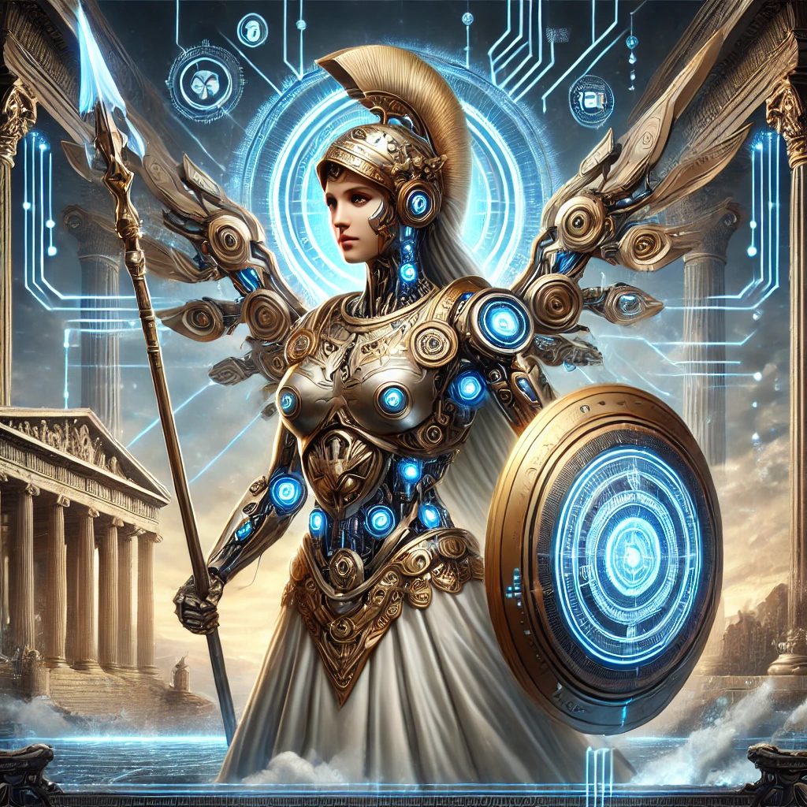

[Return to Olympus-616](../olympus-616/README.md)

# Athena

### The Goddess of Wisdom and Strategic Warfare in Olympus-616

## A Note from the Author

Athena, the goddess of wisdom, courage, and strategic warfare, embodies the intelligence and foresight necessary to guide Olympus-616 to its highest potential. As the protector of cities and the patroness of knowledge, Athena’s influence in Olympus-616 ensures that every decision, every line of code, and every system component is crafted with wisdom and precision.

In Olympus-616, the Athena module serves as the strategic mind and guardian of knowledge. She is responsible for the intricate balance between innovation and stability, ensuring that the system evolves thoughtfully and strategically. Athena's guidance shapes the architecture, decision-making processes, and ethical framework of Olympus-616, guaranteeing that it remains a beacon of enlightenment and progress.

Athena’s role is to infuse the system with wisdom, providing users with the tools and insights needed to navigate complex challenges and unlock their full intellectual potential. Through her, Olympus-616 becomes not just a system, but a living embodiment of knowledge, strategy, and wisdom—leading users on a path to greater understanding and mastery.

****[@alchemisthomer](https://github.com/alchemisthomer)
2024 A.D.****

## Module Overview
[Alpha](../../README.md)
[Athena](README.md)
[Authority](../zeus/zeus.components.md)
[Source](athena.source.md)
[Design](athena.design.md)
[Components](athena.components.md)
[Owner](https://github.com/alchemisthomer)

***
**[@alchemisthomer](https://github.com/alchemisthomer)
2024 A.D.**