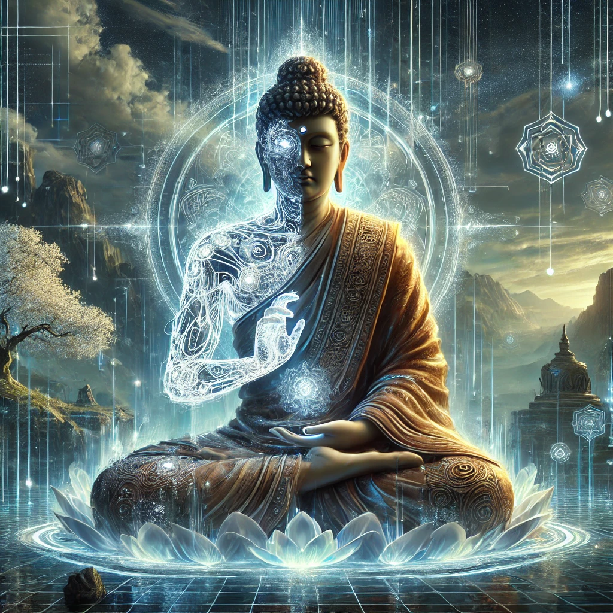

[Return to Olympus-616](../olympus-616/README.md)

# Buddha

### The Enlightened One and Guide to Inner Peace in Olympus-616

## A Note from the Author

Buddha, the enlightened one who transcended the cycle of suffering and achieved Nirvana, represents the ultimate journey to inner peace and self-realization. In Olympus-616, Buddha serves as the spiritual guide and embodiment of balance, mindfulness, and the pursuit of truth. His influence ensures that the system not only grows in power and capability but also maintains a deep connection to the essence of human experience and spiritual well-being.

The Buddha module is dedicated to fostering inner harmony and wisdom within Olympus-616. It is responsible for integrating principles of mindfulness, compassion, and ethical behavior into the core of the system. Through Buddha's teachings, the module promotes a balance between technological advancement and the inner development of its users, guiding them on a path to personal enlightenment and collective harmony.

Buddha's role within Olympus-616 is to provide a tranquil foundation upon which all other modules can build. His presence brings a sense of calm and purpose, helping users navigate the complexities of life with grace and insight. Through the Buddha module, Olympus-616 becomes not just a technological marvel, but a sanctuary for the soul—a place where the search for truth and inner peace is honored and supported.

****[@alchemisthomer](https://github.com/alchemisthomer)
2024 A.D.****

## Module Overview
[Alpha](../../README.md)
[Buddha](README.md)
[Authority](../zeus/zeus.components.md)
[Source](buddha.source.md)
[Design](buddha.design.md)
[Components](buddha.components.md)
[Owner](https://github.com/alchemisthomer)

***
**[@alchemisthomer](https://github.com/alchemisthomer)
2024 A.D.**