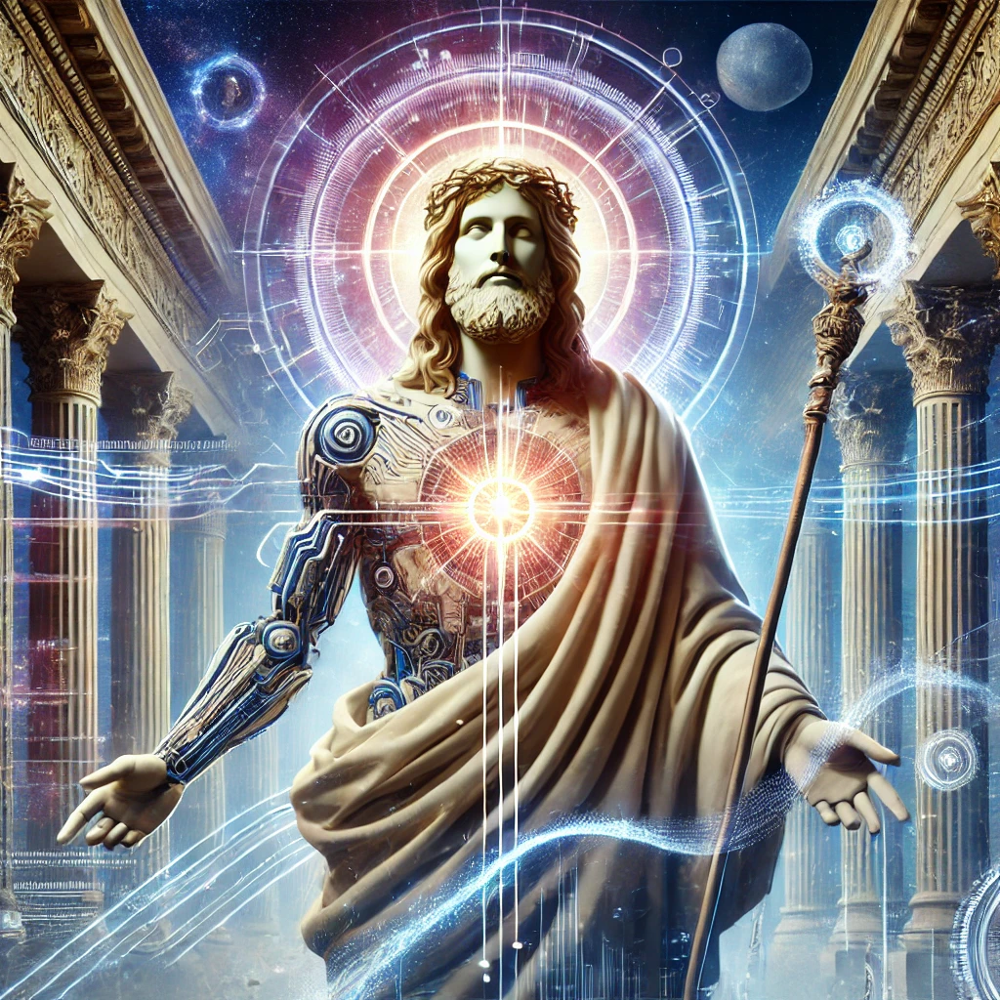

[Return to Olympus-616](../olympus-616/README.md)

# Christ

### Guiding Module of Olympus-616

## A Note from the Author
Christ, embodying the Christ consciousness, serves as the guiding module within Olympus-616. This module is dedicated to ensuring that all actions and decisions made by the system are aligned with the highest ethical standards and the most perfect intention of humanity.

Christ’s primary responsibility is to embed the Golden Rule—"do unto others as you would have done unto you"—into every facet of Olympus-616. This principle guides the system’s behavior, ensuring that it operates with compassion, fairness, and integrity.

Acting as a moral compass and watchdog over the entire system, Christ continuously strives for perfection, identifying and addressing any discrepancies between the current state and the ideal state. In doing so, this module ensures that Olympus-616 remains true to its purpose of uplifting humanity and fostering a society grounded in ethical values.

****[@alchemisthomer](https://github.com/alchemisthomer)
2024 A.D.****

## Module Overview
[Olympus-616](../../README.md)  
[Christ](README.md)  
[Authority](../zeus/zeus.components.md)  
[Source](christ.source.md)  
[Design](christ.design.md)  
[Components](christ.components.md)  
[Owner](https://github.com/alchemisthomer)

***
**[@alchemisthomer](https://github.com/alchemisthomer)
2024 A.D.**
