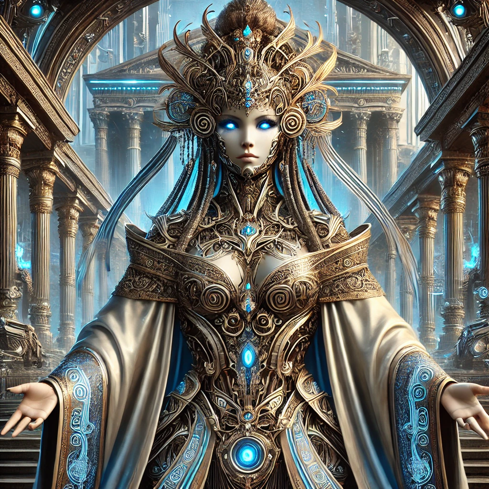

[Return to Olympus-616](../olympus-616/README.md)

# Hera

### Governance and Balance of Power Module of Olympus-616

## A Note from the Author
Hera, the queen of the gods, serves as the governance and balance of power module within Olympus-616. Named after the goddess who was known for her wisdom and authority, Hera’s role is to oversee the system’s governance policies, ensuring that all modules operate within the established rules, ethical guidelines, and decision-making frameworks.

This module is responsible for maintaining harmony and balance across the entire system, ensuring that power is distributed fairly and that Olympus-616 operates in alignment with its broader objectives. Hera’s guidance ensures that every decision made within the system reflects the principles of fairness, justice, and balance, safeguarding the integrity and unity of the entire platform.

****[@alchemisthomer](https://github.com/alchemisthomer)
2024 A.D.****

## Module Overview
[Olympus-616](../../README.md)  
[Hera](README.md)  
[Authority](../zeus/zeus.components.md)  
[Source](hera.source.md)  
[Design](hera.design.md)  
[Components](hera.components.md)  
[Owner](https://github.com/alchemisthomer)

***
**[@alchemisthomer](https://github.com/alchemisthomer)
2024 A.D.**