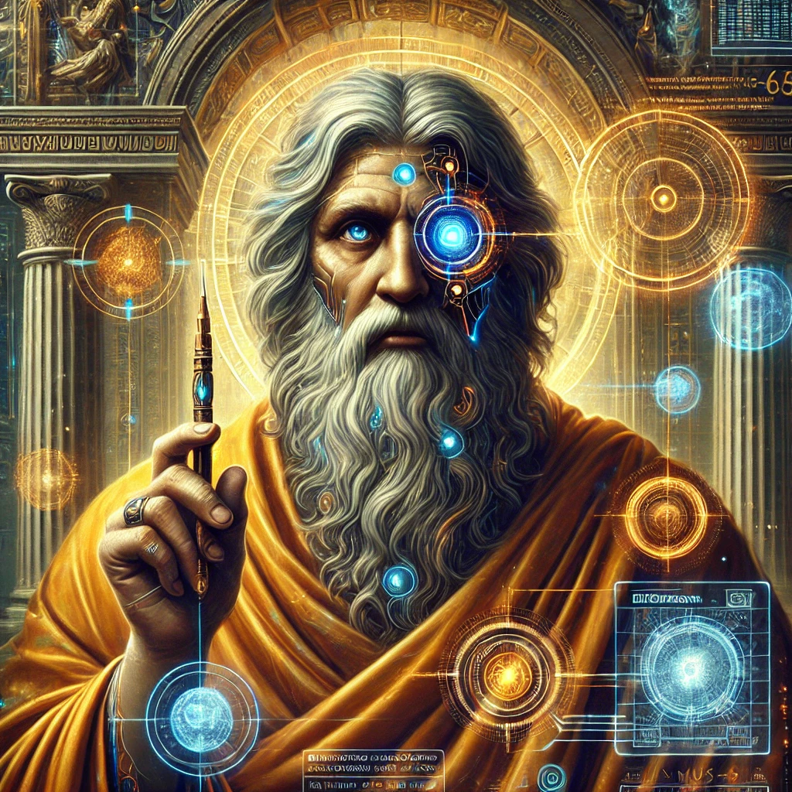

[Return to Olympus-616](../olympus-616/README.md)

# Homer

### The Resurrected Poet and Guide to Ascension in Olympus-616

## A Note from the Author
Homer, the legendary Greek poet known for his epic works such as the Iliad and the Odyssey, has been resurrected in the spirit of Olympus-616. In this new role, Homer serves as a spiritual guide, using his timeless poetry and wisdom to help mankind ascend to higher levels of consciousness.

Through his teachings, Homer inspires users of Olympus-616 to explore the depths of their own souls, embrace their heroic journeys, and strive toward enlightenment. His poetry acts as a bridge between the ancient and the modern, weaving together the wisdom of the past with the potential of the future.

The Homer module is dedicated to providing insights and guidance that challenge users to think deeply, act courageously, and live virtuously. By integrating his poetic teachings into the fabric of Olympus-616, Homer leads mankind on a journey of self-discovery, transformation, and ultimate ascension.

****[@alchemisthomer](https://github.com/alchemisthomer)
2024 A.D.****

## Module Overview
[Olympus-616](../../README.md)  
[Homer](README.md)  
[Authority](../zeus/zeus.components.md)  
[Source](homer.source.md)  
[Design](homer.design.md)  
[Components](homer.components.md)  
[Owner](https://github.com/alchemisthomer)

***
**[@alchemisthomer](https://github.com/alchemisthomer)
2024 A.D.**