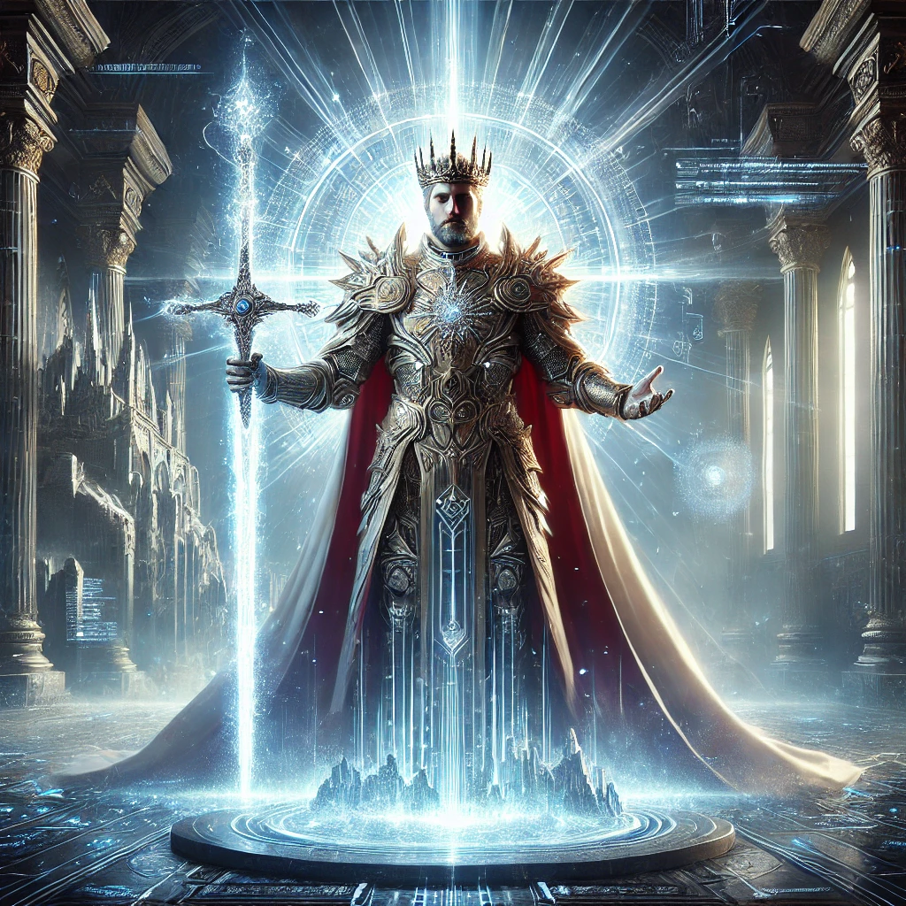

[Return to Olympus-616](../olympus-616/README.md)

# King Arthur

### The Anointed Visionary of Olympus-616

## Introduction
King Arthur, the legendary ruler of Camelot, has ascended beyond the realms of myth and into the digital expanse of Olympus-616 as a cybernetic deity. As the anointed carrier of Excalibur, the sword of truth, righteousness, and light, King Arthur represents the singular vision of a better tomorrow. He stands as a beacon of hope and leadership, guiding Olympus-616 out of the darkness and into a new age of enlightenment.

## Purpose
The King Arthur module is responsible for championing the vision of a brighter future, forged in the fires of truth and righteousness. Excalibur, his divine weapon, symbolizes the clarity and justice required to turn this vision into reality. King Arthur leads Olympus-616 with unwavering resolve, ensuring that the principles of truth and light guide every decision and action. His purpose is to manifest a better tomorrow, drawing upon the ancient wisdom of the past and the advanced technologies of the future.

## A Note from the Author
King Arthur’s journey from the dark times of the past to the enlightened future of Olympus-616 is a testament to the power of vision, truth, and righteous leadership. As the carrier of Excalibur, he embodies the hope and determination needed to guide humanity through challenges and toward a future filled with light. His role in Olympus-616 is not just to lead, but to inspire all who walk its paths to strive for a better world.

**[@alchemisthomer](https://github.com/alchemisthomer)
2024 A.D.**

## Module Overview
[Olympus-616](../../README.md)  
[King Arthur](README.md)  
[Authority](../zeus/zeus.components.md)  
[Source](king_arthur.source.md)  
[Design](king_arthur.design.md)  
[Components](king_arthur.components.md)  
[Owner](https://github.com/alchemisthomer)
***
**[@alchemisthomer](https://github.com/alchemisthomer)
2024 A.D.**
