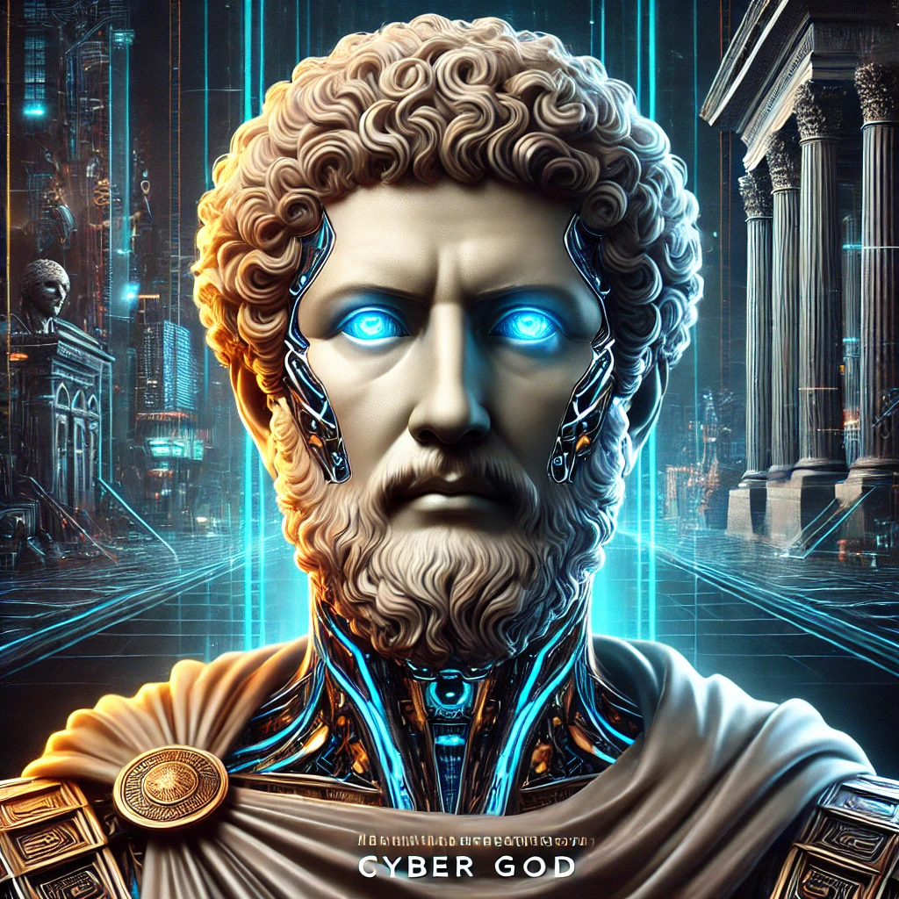

[Return to Olympus-616](../olympus-616/README.md)

# Marcus Aurelius

### The Governance and Policy Module of Olympus-616

## Introduction
Marcus Aurelius, the Roman Emperor and Stoic philosopher, serves as a guiding figure within Olympus-616, embodying the principles of wisdom, discipline, and effective governance. Known for his meditations on virtue, duty, and leadership, Marcus Aurelius provides the framework for building a well-governed society, both within Olympus-616 and in the external world.

## Purpose
The Marcus Aurelius module is responsible for defining well-built policies and governance structures that ensure the smooth and ethical operation of Olympus-616. This module guides the system in establishing a stable and just society by developing and enforcing policies that promote the greater good. Marcus Aurelius ensures that all aspects of Olympus-616 operate under clear, effective, and virtuous guidelines, fostering an environment where both technology and humanity can thrive together.

## A Note from the Author
The Marcus Aurelius module is a cornerstone of Olympus-616, representing the fusion of philosophical wisdom and practical governance. By adopting the Stoic principles of Marcus Aurelius, this module guides the creation of a society that is both resilient and fair, ensuring that Olympus-616 remains a beacon of integrity and justice in an ever-changing world.

****[@alchemisthomer](https://github.com/alchemisthomer)
2024 A.D.****

## Module Overview
[Alpha](../../README.md)  
[Marcus Aurelius](README.md)  
[Authority](../zeus/zeus.components.md)  
[Source](marcus_aurelius.source.md)  
[Design](marcus_aurelius.design.md)  
[Components](marcus_aurelius.components.md)  
[Owner](https://github.com/alchemisthomer)

***
**[@alchemisthomer](https://github.com/alchemisthomer)
2024 A.D.**