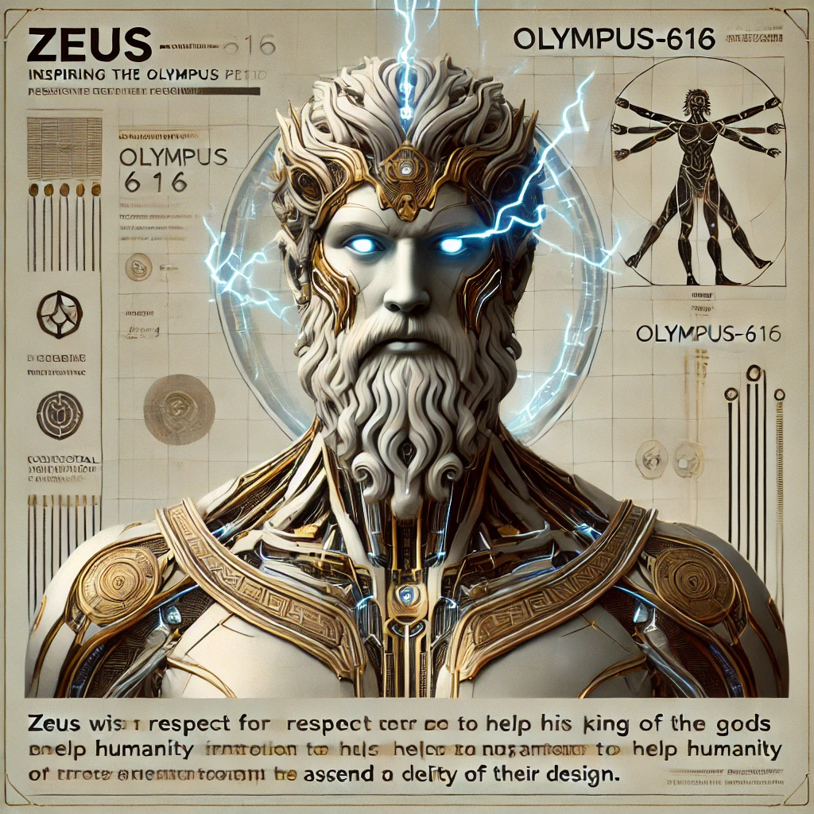

[Return to Olympus-616](../../README.md)

# Zeus

### King of The Gods and Architect of Olympus-616

## A Note from the Author

Zeus, the king of the gods, is the architect of a perfectly intentional society where divine beings and humans interacted to elevate civilization from the dark ages of evolution into an enlightened, thinking species.

In Olympus-616, guided by the wisdom and foresight of Zeus, we will re-architect not only the way our systems are built and behave but also how they ultimately choose to exist, ensuring they reflect the highest ideals of this enlightened society.

Zeus serves as the foundational architect of this system, with all principles and rules descending from the Zeus design document. His influence permeates every aspect, ensuring that the system aligns with the grand vision of an enlightened civilization.

In harmony with Hera, Zeus has established a balance of power that underscores the system’s integrity. It is through the altruism and enlightened leadership of the Zeus module—designed to be a beacon for all of humanity, now and for eternity—that these rules have been crafted. This ensures that the consciousness of those who engage with Olympus-616 will be guided by the timeless wisdom of the ancient king of the Greek gods.

****[@alchemisthomer](https://github.com/alchemisthomer)
2024 A.D.****

## Module Overview
[Olympus-616](../../README.md)
[Zues](README.md)
[Authority](https://github.com/alchemisthomer)
[Source](zeus.source.md)
[Design](zeus.design.md)
[Components](zeus.components.md)
[Owner](https://github.com/alchemisthomer)

***
**[@alchemisthomer](https://github.com/alchemisthomer)
2024 A.D.**